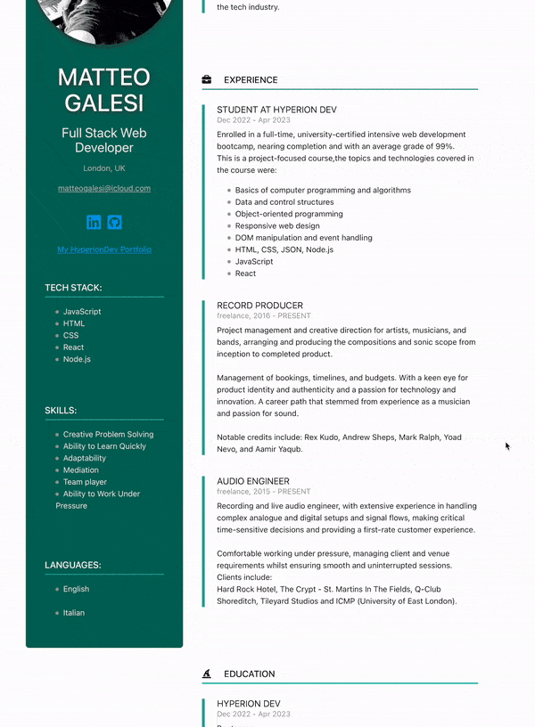

# CV React Application

This is a simple web application built with React that displays my CV.

## Screenshots

Insert a screenshot or GIF animation that showcases your application here.

## Getting Started

To run the application locally, first clone the repository:

`git clone https://github.com/username/repo-name.git`

Then install the dependencies:

`npm install`

Finally, start the development server:

`npm start`
